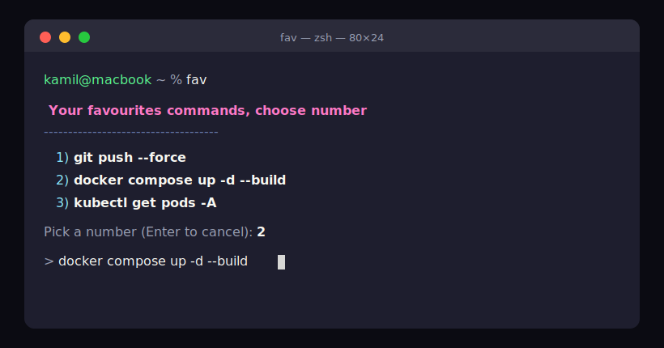

# Fav — your favourite commands, one keystroke away

**Fav** is a tiny shell tool for **bash** and **zsh** that lets you save your
favourite commands and recall, edit, and run them by number — across **multiple
named lists**. Keep a general list plus dedicated ones for Node.js, Docker,
Kubernetes, or anything else, each launched by its own command.

---

## How it looks

<p align="center">
  
</p>

Run `fav` to see your saved commands in a colourised, numbered menu. Pick a
number and the command drops onto an **editable prompt** — adjust it if you like,
then press Enter to run it. Colours switch off automatically when output isn't a
terminal or when `NO_COLOR` is set, so piping and redirecting stay clean.

---

## How it works

Every list is launched by its own command name (its **tag**). The default `fav`
command is always available. Each tag command supports:

| Command             | Action                                                                                                          |
|---------------------|-----------------------------------------------------------------------------------------------------------------|
| `fav`               | Lists favourites numbered. Pick a number → the command appears on an **editable** prompt → edit, then Enter to run (empty/Ctrl-C cancels). |
| `fav add <command>` | Adds an inline command, e.g. `fav add ls -la`.                                                                   |
| `fav add`           | Prompts you to type or paste a command. Use this for commands with quotes or pipes.                             |
| `fav create`        | Creates a **new list** with its own command name.                                                               |
| `fav mylist`        | Shows all available lists with their descriptions.                                                              |
| `fav help`          | Shows usage.                                                                                                     |

Replace `fav` with any tag you created (e.g. `jsfav add "npm test"`). The
`create` and `mylist` subcommands behave the same no matter which tag you use.

Lists are read **live** from their data file every time, so new commands show up
immediately after `add` — no reloading required.

### Tab completion

Once the engine is sourced, `<Tab>` autocompletes in both bash and zsh:

- **Command names** — type a prefix of any list command and press Tab to
  complete it, e.g. `jsf<Tab>` → `jsfav`.
- **Subcommands** — after a list command, Tab completes the first word to a
  subcommand, e.g. `fav a<Tab>` → `fav add` (also offers `create`, `mylist`,
  `help`).

Completion is scoped to command names and subcommands only — the commands you
save inside a list are never suggested or run by Tab. Newly created lists get
completion automatically.


### Creating a new list

```text
$ fav create
Command name to launch this list (e.g. fav, jsfav, and) (Default: fav): jsfav
Short description of what this list is for: Node.js / JavaScript commands
Created list "jsfav". Use it by typing: jsfav
```

- Pressing Enter at the first prompt (no input) creates/uses the default `fav` list.
- The tag is recorded in `~/.favourites/my_list` (tag line + description line),
  a data file `~/.favourites/lists/<tag>` is created, and the new command becomes
  usable straight away in your current shell.

---

## Where things live

The live tool runs from `~/.favourites/`:

```text
~/.favourites/
  fav         # the Fav engine, sourced from your shell startup file
  my_list     # registry of your lists (a tag line + description line per list)
  lists/      # one data file per list, named after the list's command (tag)
```

Each list you create stores its commands in its own file inside `lists/`, named
after the list's command (tag):

```text
~/.favourites/lists/
  fav         # commands for the default `fav` list
  general     # commands for a list launched by `general`
  jsfav       # commands for a list launched by `jsfav`
```

`general` and `jsfav` above are **only examples** — you choose the names when you
run `fav create`, and nothing requires them to exist. Keeping list data under
`lists/` also means a list's data file can never clash with the `fav` engine
file at the root.

This repository holds the source files:

| File         | Purpose                                                                |
|--------------|------------------------------------------------------------------------|
| `fav`        | All the logic — a shell function meant to be **sourced**, not executed  |
| `install.sh` | Installer: creates `~/.favourites/`, copies `fav`, prints setup steps   |
| `my_list`    | Sample registry of lists (tag/description pairs)                        |
| `README.md`  | This document                                                          |

---

## Installation

1. **Run the installer from this folder:**

   ```bash
   ./install.sh
   ```

   It creates `~/.favourites/`, copies the `fav` engine there, and prints the
   exact line to add to your shell startup file (it does **not** edit that file
   for you).

2. **Add the printed line to your shell startup file** — `~/.zshrc` for zsh or
   `~/.bash_profile` for bash:

   ```bash
   [ -f ~/.favourites/fav ] && source ~/.favourites/fav
   ```

3. **Reload your shell** (or open a new terminal):

   ```bash
   source ~/.zshrc        # zsh
   # or
   source ~/.bash_profile # bash
   ```

That's it — type `fav` to start, or `fav create` to add another list.

### What that load line means

```bash
[ -f ~/.favourites/fav ] && source ~/.favourites/fav
```

- `[ -f ~/.favourites/fav ]` — test whether the file exists and is a regular file.
- `&&` — only run the next part if that test succeeded.
- `source ~/.favourites/fav` — read the file into your **current** shell so the
  `fav` function (and any lists you created) become available. Sourcing, not
  executing, is what keeps the functions defined after the file finishes.

The `-f` guard means a new terminal still opens cleanly even if the file is
missing or renamed.

---

## Notes

- **bash & zsh:** the engine adapts to each shell — it uses bash readline for the
  editable run prompt and zsh's `vared` under zsh, and normalises array handling
  so listing works the same in both.
- **Why no file extension?** `fav` is *sourced*, so the extension is irrelevant
  to the shell. Keeping it extensionless matches the other dotfiles it lives
  beside (`.zshrc`, `.bash_profile`) and mirrors the `fav` command name.
- **Custom location:** set `FAV_DIR` before sourcing to point at a different base
  folder, e.g. `export FAV_DIR=~/mystuff/favs`.
- **Quotes & pipes:** when adding a command inline, the shell parses quotes and
  pipes before `fav` sees them. For anything fancy, use interactive `fav add`
  (no arguments) and paste the full command, or single-quote it inline.
